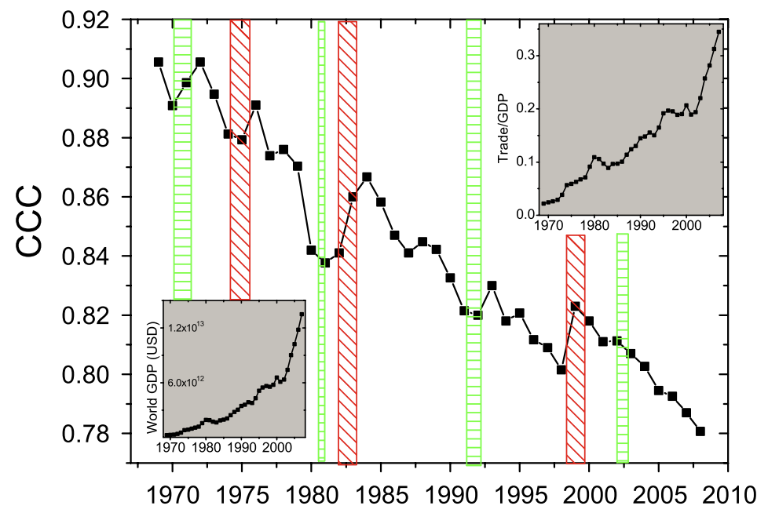

## Complex networks
- (Definition.) Complex systems = networks with many interacting/moving parts
    - Properties of the whole may appear that are not evident from the parts, through *emergence*
    - Difficult to devise analytical solutions for
    - Can be described most easily through the interactions between agents, i.e. through a graph
- (Definition.) Three levels of network analysis:
    - Level 1: purely topological; two nodes are either connected or not connected, with no weights. Adjacency matrix is binary (only 0s and 1s)
    - Level 2: links can have information (weights and direction). Adjacency matrix can have any numbers.
    - Level 3: nodes themselves can have information.
        - Analyzing networks at level 2 may reveal *bow-tie structures*, i.e. a core-periphery structure of the graph where a central section is strongly interconnected and the side sections are not
        - This is called a SCC (strongly connected component)
        