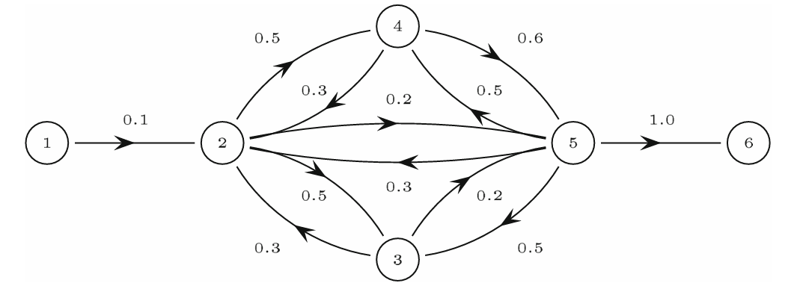

- Problem: so far, we've observed the following two problems in the integrated ownership model -
    1. SCCs lead to disproportionately high integrated values due to self-loops
    2. Root nodes lead to accumulation of flow
- The first problem was solved with the correction operator $D$ 
- Two adjustments can be made to the model to correct the second problem

## Analytical solution to the bowtie problem
- Definition. Define the *bowtie-corrected integrated ownership matrix* as $\bar{W}=W(\hat{W}+D)$, where $\hat{W}$ denotes the self-loop-corrected integrated ownership $\hat{W}=D\tilde{W}$. 
- Derivation.  First, observe that because we defined the self-loop-corrected network value as $\hat{v^{net}}=Dv^{net}$, we have the corrected integrated value
$$
\hat{\nu^{int}}=\hat{W}v=D\tilde{W}v=DWv^{net}\neq  WDv^{net}
$$
due to the non-commutativity of matrix multiplication. We previously noted that $v^{net}=\nu^{int}+v$ and thus
$$
\begin{aligned}
\hat{v}^{net} &= Dv^{net} \\
&=D\nu^{int}+Dv \\
&=D\tilde{W}v+Dv \\
&=\hat{W}v+Dv
\end{aligned}
$$
but as $\hat{W}v$ now no longer equals $W\hat{v}^{net}$, we can now define an alternative correction to $v^{net}$, denoted $\bar{v}^{net}$:
$$
\begin{aligned}
\bar{v}^{net} &= WDv^{net} + Dv, \text{ noting the change in order of $W$ and $D$}\\
&= W\hat{v}^{net}+Dv \neq \hat{v}^{net}
\end{aligned}
$$
Using $\hat{v}^{net}=D\nu^{int}+Dv = D\tilde{W}v+Dv$, we have
$$
\begin{aligned}
\bar{v}^{net}&=WD\tilde{W}v+WDv+Dv \\
&=W(D\tilde{W}v+Dv)+Dv \\
&=W(\hat{W}+D)v+Dv
\end{aligned}
$$
where $W(\hat{W}+D)$ is defined as our **bowtie-corrected integrated ownership matrix** $\bar{W}$, analogous to the presence of $\hat{W}$ in $\hat{v}^{net}$. 

## Summary of corrections

- (Theorem.)
1. The original network value $v^{net}$, integrated value $\nu^{int}$, and integrated ownership matrix $\tilde{W}$: $v^{net}=\nu^{int}+v=\tilde{W}v+v$
2. The self-loop-corrected network value $\hat{v}^{net}$, integrated value $\hat{\nu}^{int}$, and ownership matrix $\hat{W}$: $\hat{v}^{net} = \hat{\nu}^{int} + Dv = D\tilde{W}v + Dv = \hat{W}v + Dv$
3. The bowtie-corrected network value $\bar{v}^{net}$, integrated value $\bar{\nu}^{int}$, and ownership matrix $\bar{W}$: $\bar{v}^{net} = \bar{\nu}^{int} + Dv = \bar{W}v + Dv\ (=WDv^{net}+Dv)$.

## Algorithmic implementation
- The main issue with the above corrections is computational speed: matrix inversion has complexity $\mathcal{O}(n^3)$, which can become infeasible when dealing with very large matrices (e.g. a network of all firms in a country)
- An algorithm involving the following steps can be implemented to calculate network value for any given node $i$, through which integrated value can be easily found:
1. Breadth-first search (BFS) is implemented on node $i$, returning a set of nodes that are reachable from node $i$ (in however many steps). Call this set $\mathcal{S_i}$.
2. $\mathcal{S}$ represents a subnetwork of the original network; all nodes in this network are connected, directly or indirectly, to $i$. Without loss of generality, relabel the node $i$ to $1$, and the other nodes $2$, $3$, etc. Call the adjacency matrix derived from this subnetwork $B(i)$.
3. Remove all the incoming links to $i$ such that now, no firm owns any shares in $i$. $B(i)$ now looks like this:
$$
B(i)=\begin{bmatrix}
0  & \vec{d} \\
\vec{0} & B^{sub}
\end{bmatrix}
$$
where $\vec{d}$ is the row matrix representing the ownership of firm 1 in other firms (its outgoing links), $B^{sub}$ is a matrix representing the adjacency network of the subnetwork aside from node $1$, and $\vec{0}$ is the zero vector. The first column of this adjacency matrix is zero, because no firm owns shares in node $1$. 
4. Calculate the network value of the node $i$: by definition of network value, $v^{net} = W(I-W)^{-1}v$ where $v$ is the intrinsic value vector and $W$ is the adjacency matrix. Using $W = B(i)$ and $v = v^{sub}$ yields the network value.

> (Theorem.) The operation of removing all incoming links to $i$ for the subnetwork represented by $B(i)$ is mathematically equivalent to performing the self-loop correction on $B(i)$: $\hat{B(i)}=DB(i)$.

> (Proof.) Recall that the corrected integrated ownership matrix $\hat{W}$ was defined in scalar form as:
$$
\hat{W}_{ij}=W_{ij}+\sum_{k\neq i} \hat{W}_{ik}W_{kj}
$$
> As the subnetwork with ownership matrix $B$ instead of $W$ preserves all the outgoing connections $W_{ik}$ of $i$ but removes all the incoming connections $W_{ki}$, $\hat{B}_{ij}$ can no longer contain any self-loops; thus, $\hat{B}_{ij}$ is equal to $\hat{W}_{ij}$ with $\hat{W}_{ii}$, the self-loop coomponent, removed. This leads to
$$
\hat{B}=\hat{W}-\text{diag}(\hat{W})
$$
> in matrix form, and with
$$
D = I - \text{diag}(\hat{W})
$$
> we have $\hat{B} = D + \hat{W} - I$. Thus $\hat{B}v + v$, the network value of the subnetwork by definition, is equal to 
$$
Dv + \hat{W}v - v + v = \hat{W}v + Dv = \hat{v}^{net}
$$
> which is the self-loop corrected network value for the original network.

- **Correcting for bowtie structures**. 

- Definition. **Three subsets of a bowtie-structured network**. A bowtie-structured network can be divided roughly into the following three subsets:
1. $\mathcal{O}$, the OUT subset, containing the labels of all nodes that are *leaf nodes* - that is, with only incoming connections and no outgoing connections.
2. $\mathcal{I}$, the IN subset, containing all *root nodes* - nodes that have outgoing connections and no incoming connections. As noted, these nodes are where integrated value aggregates erroneously.
3. $\mathcal{S}$, the SCC. We have all of $\mathcal{O}, \mathcal{I}, \mathcal{S} \subset \mathcal{S_i}$, the subnetwork formed from breadth-first search on node $i$. We also have ${\mathcal{O} \cap \mathcal{I}} = \emptyset$.
- We apply the algorithm detailed above to calculate $v^{net}$ in the following order:
1. On $\mathcal{O}$, all the nodes in the OUT subset.
2. On $S_O$, all the nodes in the SCC that are directly connected to $\mathcal{O}$. Calculate their network values by applying the algorithm above, or simply by $v^{net}(s) = \sum_{o} W_{so}v^{net}(o)$ for $s\in S_O$ and $o \in \mathcal{O}$ connected to node $s$: the network value of all the OUT nodes connected to $s$, weighted by the weight of the links $W_{so}$. This network value is added to the original intrinsic values of these nodes: $v_s \to v^{net}(s) + v_s$.
3. On the SCC itself $\mathcal{S}$, not including any nodes in $\mathcal{O}$ or $\mathcal{I}$. Apply the algorithm above to find their network values $v^{net}$, taking into account that nodes within the SCC connected to $\mathcal{O}$ had their intrinsic values modified as per above.
4. On $S_I \subset \mathcal{I}$: the subset of the IN set that is directly connected to the SCC $\mathcal{S}$. This is the subset that will be adjusted to correct for accumulation of flow. We directly set for all $s \in S_I$: $v^{net}(s) = \sum_{i} W_{si}v^{net}(i)$, ensuring that the network value of these IN nodes will not be the accumulated value of every node in the SCC, but rather, only the weighted sum of the values of the nodes they are connected to.
5. On $\mathcal{I}$, taking note to add the network values calculated in the previous step to the intrinsic value of the nodes.

- For instance, the algorithm breaks down this network through the following steps:

- $\mathcal{I} = \{1\}$; $\mathcal{O} = \{6\}$; $\mathcal{S}=\{2,3,4,5\}$
- Denote the vector of network values due to the algorithm above as $\dot{v}^{net}$. We will also have $\dot{\nu}^{int}=\dot{v}^{int}-v$.

