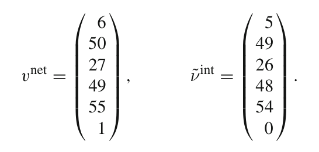
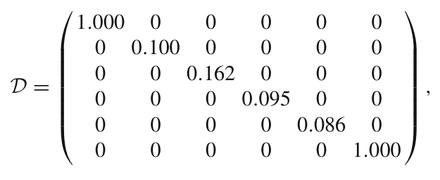

## Bowtie problem and refinements for group ownership
- (Problem 2). The *bow-tie* problem. 
    - Consider this example of a network exhibiting a bow-tie topology:
    
    - A SCC (strongly connected component) lays in the center, with firms closely interconnected with one another; two firms (1) and (6) are not part of the SCC and are only loosely connected to the SCC through a single connection
    - Applying the group ownership model on this example demonstrates the bow-tie problem
        - Suppose that the underlying value of each firm is 1: the column vector $v = (1,1,1,1,1,1)$.
        - Using the ownership matrix given above, the uncorrected integrated value and network values are given to be
        
        which are disproportionately high considering that the total underlying value of the network is $1+1+1+1+1+1=6$, but e.g. the network value of the 5th firm reaches 55, an order of magnitude larger.
        - Introducing the correction operator
        leads to the corrected integrated and network values
        
        reduced by approx. one order of magnitude.
    - The issue lies with firm 1: it is not part of the SCC and only owns a very small share in firm 2, as shown. However, the correction operator does not correct its values at all (because firm 1 is a *root node*, a node where there are no incoming connections) and thus the integrated value and network values of firm 1 are both the largest among the group after corrections
        - The formula for integrated value means that as firm 1 owns a small share of firm 2 (part of the SCC), the integrated value of the entire SCC is added to firm 1
    - This is clearly undesireable, as firm 1 is not very involved in the group and should not have this high of a network value