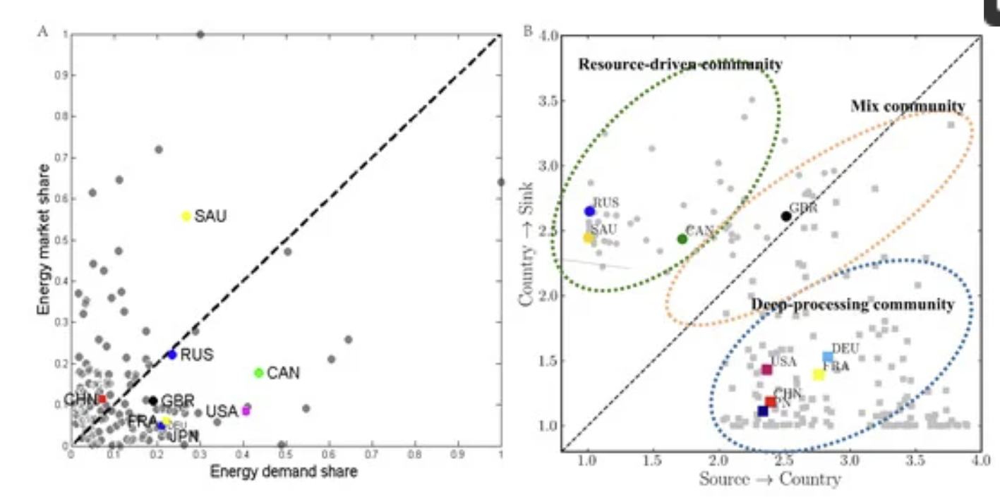

### Wu et al., 2020

A model that seeks to quantify some "distance of trade", indicating the resistance between countries in trade, is proposed based on the WTN; it improves upon the gravity model by considering multilateral resistance and other trade barriers.

***

## Literature review

- Trade is strongly correlated with economic growth; economic complexity as proposed by Hausmann leads to the implication that future growth of a country is constrained by past imports and exports
- Gravity model now controversial; distance cannot fully capture resistance effects in trade ([[International Trade Network.Crisis Propagation.Bootstrap Percolation and Attack]])
    - This is known as "the missing globalization puzzle"; distance no longer matters as much as before
    - Authors like Lin and Sim 2012, Yotov 2012, Carrere et al. 2013 and Larch et al. 2016 use more factors in the gravity equation, which leads to bloated formulas
    - Variables are intercorrelated and lead to multicolinearity problems
- New measure of trade distance w/ multilateral and network effects are needed:
    - Maciejewski 2019 demonstrates that common humanistic factors (religion, border, language) determine trade in the EU
    - Intermediate merchandise trade (e.g. trade of technology) leads to improvement in technology
- Effect of distance may vary as GDP of trading nation varies
    - The ITN can quantify the hidden factors in the gravity equation because the ITN is inherently formed from politics, language, religion, etc., etc.
    - Distance can be defined based on network effects (e.g. shortest path), but does not consider trade flows (i.e. value chains)
        - E.g. a network distance of 1 node away does not have anything to do with the geographical distance between the countries

## Methods

- CEPII database gives geographical distance
- GDP data from World Bank
- Trade data from UN Comtrade
- Define an "International Trade Flow Network" (ITFN):
    - Regular network + two nodes, one labeled "source" (label 0), one labeled "sink" (label $N+1$)
    - Source -> all countries = domestic output of that country
    - All countries -> sink = domestic consumption
    - Source - sink = imported - exported; Source + exported = imported + sink, or
    $$
    \sum_{j=0}^N f_{ij} = \sum_{j=1}^N f_{ji}
    $$

### Flow distance

- Flow distance $l_{ij}$ measures relative trade flows between $i$ and $j$
- Expected value of distance between $i$ and $j$ is 
$$
t_{ij}=\sum_{k=1}^\infty kp_{ij}(k)
$$
where $p_{ij}(k)$ is the probability that a path from $i$ to $j$ is length $k$
- Let $M$ be the *Markov matrix* where each element $M_{ij}$ is the probability of $i$ moving to $j$ at the time-step: $M_{ij} = \frac{f_{ij}}{\sum_{j=1}^N f_{ij}}$
- Then the probability that at time-step $k$, $i$ moves to $j$ is $M^k_{ij}$
- Thus the amount that flows to $j$ at time step $k$ from $i$ is $\phi_{0i} M^k_{ij}$, where $\phi_{0k}$ is initial flow from source to $i$

- This leads to 
$$
p_{ij}(k) = \frac{\phi_{0i} M^k_{ij}}{\phi_{0i} (I + M + M^2 + ...)_{ij}}
$$
where the denominator is total flow over infinite timesteps. Denote the infinite sum $I + M + M^2 ... = U$.
- Thus
$$
t_{ij} = \sum_{i=1}^\infty \frac{kM_{ij}^k}{U_{ij}} = \frac{(MU^2)_{ij}}{U_{ij}}
$$
by algebraic expansion. Finally, we symmetrize flow distance via $c_{ij} = t_{ij} - t_{ji}$ and flow distance
$$
l_{ij} = \frac{2}{\frac{1}{c_{ij}} + \frac{1}{c_{ji}}}
$$

- Flow distance leads to better performance in the gravity model than geographical distance
- Source-to-country and country-to-sink flow distance can be used to cluster countries into suppliers of the product and demanders of the product

