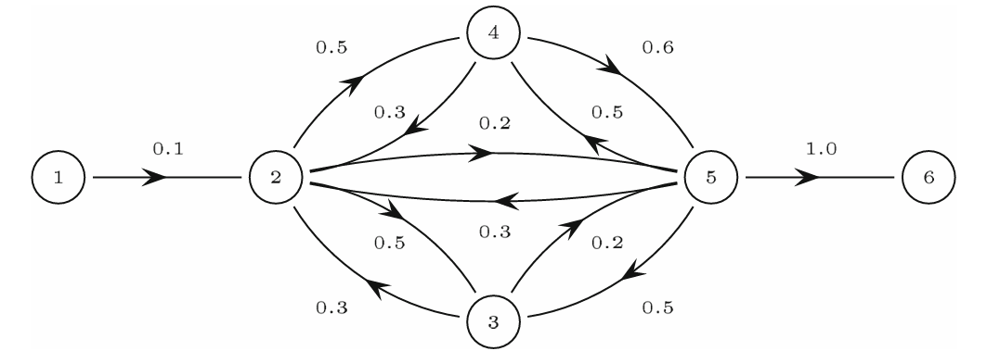

## Interpreting ownership networks as flow

- (Observation.) A physical analogy for ownership networks: the network expresses flow.
    - Suppose each node carries some volume of liquid $v_j$, and a connection between node $i$ and node $j$ $W_{ij}$ expresses a *flow* of liquid from $j$ to $i$; in particular, we define it as the fraction of liquid $v_j$ that flows to $i$ at any time
    - Definition. At every time step $t$, we can define $\phi_i(t)$, the inflow of liquid to node $i$, as the following:
    $$
    \phi_i(t)=\sum_{j} W_{ij}(v_j + \phi_j(t-1))
    $$
    or in matrix notation,
    $$
    \phi(t) = W(v+\phi(t-1))
    $$
    - Interpretation. The inflow of liquid to $i$ is the amount of liquid present in all the other nodes $j$ weighted by the percentage flow $W_{ij}$, plus the amount of liquid flowing into all other nodes $j$ in the last time-step weighted by $W_{ij}$.
    - The steady-state solution for this system is $\phi = W(v+\phi)$, which has solution
    $$
    \phi = (1-W)^{-1}Wv.
    $$
    - Observation. $\phi = \nu^{int}$, the integrated value of the system.
    - Interpretation. The integrated value $\nu^{int}=\hat{W}v$ is an expression of how much a firm's ownership of other firms is worth; as such, it is also an expression of the flow of assets/stocks/value from all other firms to one firm.
        - This can intuitively explain the bowtie problem present in systems like the following:
        
        - Node 1 is a *root node*, meaning that it has only outgoing ownership connections and no incoming connections (it owns other firms, but no firm owns it). Thus, when considering this network from the perspective of flow, assets will flow *towards* Node 1 but not *away* from it. 
        - Eventually, assets will accumulate in Node 1, leading to an extremely large integrated value.
        - This also explains the problem of *self-loops* and overestimation of integrated value in SCCs: the more self-loops that are present, the longer the assets will flow through the network
        - This would be physically accurate behavior (i.e. if it was liquid and not cash flowing, accumulation at root nodes and self-loops would be deemed correct), but not economically accurate behavior
    