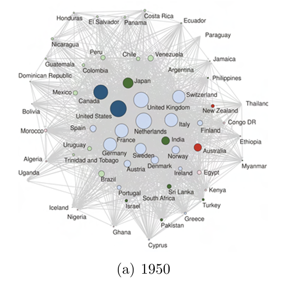
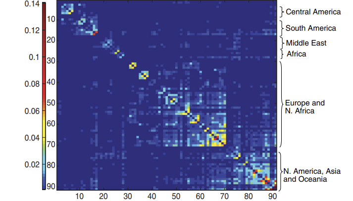

## Ownership networks
- (Concept.) Ownership networks:
    - Graphs which illustrate the ownership of firms over other firms, using percentage of ownership as a metric
    - (Definition). Percentage of ownership = fraction of total shares that a shareholder owns of a firm
        - Shareholders are either entities who cannot be owned (people, governments, legal entities) or corporations who themselves can be owned
    - The Level 3 (most complete) representation of an ownership network is as follows:

- $W_{ij}$ (arrow from firm $i$ to $j$): percentage ownership that firm $i$ has in $j$
- $v_j$: a variable of the node $j$ representing the "economic value" of firm $j$ (e.g. market cap)
- The adjacency matrix $W$ holds all such $W_{ij}$; it is column stochastic because $\sum_{i=1} W_{ij}=1$ by definition (sum of percentage shares of all shareholders in firm $j$)

## Models of ownership networks
- (Question). Given a certain ownership network, what can be said about the distribution of control?
    - The ownership network will have an associated adjacency matrix
    - It may have cycles (i.e. $k$ owns parts of $l$ and also vice versa):
    
    - If there are no cycles, we can say that $W_{ik}$ (see (a)) is simply the product of the ownership of $i$ in the parent company $j$ and the ownership of $j$ in $k$: $W_{ik}=W_{ij} W_{jk}$.
    - However, the presence of cycles makes this significantly more difficult
    - (Definition). *Direct ownership* is e.g. $i$ owning $j$ (two firms directly connected by an arrow), and *indirect ownership* is two firms not directly connected yet still linked (e.g. $A$ owns $B$ which owns $C$, so $A$ indirectly owns $C$)
    - (Definition). The *portfolio value* $p_i$ of a firm $i$ is the sum of the value of all the shares it owns: $p_i=\sum_{j\in\Gamma(i)} W_{ij}v_j$, where $\Gamma(i)$ is the set of all the neighbors of $i$
        - Written in matrix form this is $\mathbf{p=Wv}$.